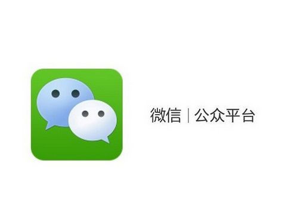

# Service for WeChat public account  
---

## What the Service can do  
&nbsp;&nbsp;&nbsp;&nbsp;&nbsp;This service for WeChat official account can automaticly reply the request from public account's follower, and the request may be a word, sentence, picture and even a pice voice.
## What language the project uses
&nbsp;&nbsp;&nbsp;&nbsp;&nbsp;This project is composed of pure python code.
## Resource
&nbsp;&nbsp;&nbsp;&nbsp;&nbsp;This job is just a practice of the example code from Tencent websit of WeChat development.
&nbsp;&nbsp;&nbsp;&nbsp;&nbsp;You can seaching for more detailed imformation about how to create more useful service for WeChat public accout.
&nbsp;&nbsp;&nbsp;&nbsp;&nbsp;[Tencent document](https://mp.weixin.qq.com/wiki?t=resource/res_main&id=mp1472017492_58YV5)
